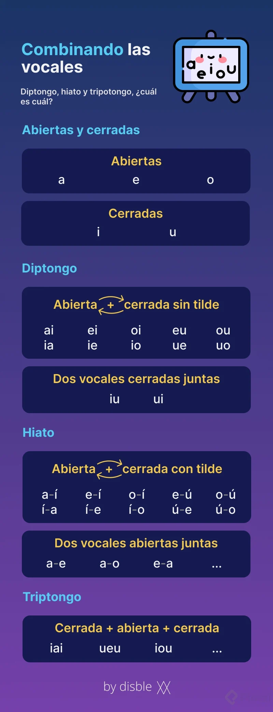
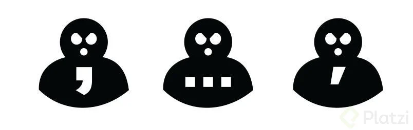

# Ortografía Básica

#### Mariadrea

# Tabla de contenido 

- [1. ¿La ortografía para qué?](#1.-¿La-ortografía-para-qué?)
  - [La importancia de escribir bien](#La-importancia-de-escribir-bien)
  - [¿Qué es la ortografía?](#¿Qué-es-la-ortografía?)
  - [¿Cómo aprenderás a escribir mejor?](#¿Cómo-aprenderás-a-escribir-mejor?)
- [2. Letras](#2.-Letras)
  - [Hablemos de las letras](#Hablemos-de-las-letras)
  - [Mayúsculas y minúsculas](#Mayúsculas-y-minúsculas)
  - [Ejemplo: mayúsculas y minúsculas](#Ejemplo:-mayúsculas-y-minúsculas)
  - [Reto: mayúsculas y minúsculas](#Reto:-mayúsculas-y-minúsculas)
  - [¿Cómo aprender las reglas de ortografía?](#¿Cómo-aprender-las-reglas-de-ortografía?)
  - [La B y la V](#La-B-y-la-V)
  - [Ejemplo: La B y la V](#Ejemplo:-La-B-y-la-V)
  - [Reto: La B y la V](#Reto:-La-B-y-la-V)
  - [La S, la C y la Z](#La-S,-la-C-y-la-Z)
  - [Ejemplo: La S, la C y la Z](#Ejemplo:-La-S,-la-C-y-la-Z)
  - [Reto: La S, la C y la Z](#Reto:-La-S,-la-C-y-la-Z)
  - [La G y la J](#La-G-y-la-J)
  - [Ejemplo y reto: La G y la J](#Ejemplo-y-reto:-La-G-y-la-J)
  - [La LL y la Y](#La-LL-y-la-Y)
  - [Ejemplo y reto: La LL y la Y](#Ejemplo-y-reto:-La-LL-y-la-Y)
  - [La H](#La-H)
  - [Ejemplo: la H](#Ejemplo:-la-H)
  - [Reto: la H](#Reto:-la-H)
- [3. Sílabas y Palabras](#3.-Sílabas-y-Palabras)
  - [Reglas de división de las palabras en sílabas](#Reglas-de-división-de-las-palabras-en-sílabas)
  - [Diptongo, triptongo e hiato](#Diptongo,-triptongo-e-hiato)
  - [La sílaba tónica, el acento y la tilde](#La-sílaba-tónica,-el-acento-y-la-tilde)
  - [Palabras agudas](#Palabras-agudas)
  - [Palabras llanas o graves](#Palabras-llanas-o-graves)
  - [Palabras esdrújulas](#Palabras-esdrújulas)
  - [Palabras sobreesdrújulas](#Palabras-sobreesdrújulas)
  - [Tildes diacríticas](#Tildes-diacríticas)
  - [Ejemplo: el uso de la tilde](#Ejemplo:-el-uso-de-la-tilde)
  - [Reto: el uso de la tilde](#Reto:-el-uso-de-la-tilde)
  - [Reto: tus palabras clave](#Reto:-tus-palabras-clave)
- [4. Oraciones](#4.-Oraciones)
  - [Estructura de la oración y tipos de oraciones](#Estructura-de-la-oración-y-tipos-de-oraciones)
  - [Tipos de palabras](#Tipos-de-palabras)
  - [Reto: tu idea principal](#Reto:-tu-idea-principal)
- [5. Párrafos](#5.-Párrafos)
  - [La importancia de la puntuación](#La-importancia-de-la-puntuación)
  - [Los signos de puntuación](#Los-signos-de-puntuación)
  - [La coma criminal](#La-coma-criminal)
  - [Ejemplo: los signos de puntuación](#Ejemplo:-los-signos-de-puntuación)
  - [Reto: los signos de puntuación](#Reto:-los-signos-de-puntuación)
  - [Reto: tu primer párrafo](#Reto:-tu-primer-párrafo)
- [6. Textos](#6.-Textos)
  - [Construyendo un texto](#Construyendo-un-texto)
  - [Estructura de un texto](#Estructura-de-un-texto)
  - [Errores comunes al escribir un texto](#Errores-comunes-al-escribir-un-texto)
  - [Reto: tu texto completo](#Reto:-tu-texto-completo)
  - [¿Qué más te gustaría aprender?](#¿Qué-más-te-gustaría-aprender?)
- [7. Mentorías Expert](#7.-Mentorías-Expert)
  - [La importancia de tener una buena ortografía](#La-importancia-de-tener-una-buena-ortografía)

---

# 1. ¿La ortografía para qué?

  ## La importancia de escribir bien

Si estás haciendo este curso es porque eres una persona que busca crecer profesionalmente, y no sólo en lo que haces, sino también en cómo te presentas a tus oportunidades laborales. Elaborar tu hoja de vida, portafolio o página personal con una ortografía perfecta es parte de un perfil profesional óptimo.

Un estudio de la Confederación de Reclutamiento y Empleo en Gran Bretaña encontró que el 50% o más de las hojas de vida tienen errores de ortografía y esto en muchos casos puede significar la diferencia entre recibir una respuesta como: “¡Bienvenido, mañana empiezas!” o “No nos llames, nosotros te llamaremos”.

En otro estudio, la BBC encontró que la presencia de tan sólo un error ortográfico en un sitio web dedicado al comercio electrónico, podría provocar una disminución en sus ingresos de hasta en un 80%.

Es muy importante para tu marca personal y para la imagen de tu negocio que escribas bien. El 59% de las personas encuestadas en un estudio de Global Lingo indicó que su confianza en una marca se vería disminuida o incluso dejaría de comprar sus productos debido a errores ortográficos o una mala escritura a través de las redes sociales.

Incluso al momento de encontrar una pareja sentimental, tener una mala ortografía podría significar un punto en tu contra en sitios de citas o búsqueda de parejas como match. com.

En este curso aprenderás todo lo necesario para mejorar tu ortografía y con ello mejorar también la manera en que te presentas a los demás.

  - [Consejos para escibir Mejor](https://platzi.com/blog/consejos-para-escribir-bien-y-brillar-en-el-mundo-laboral/)
  - [Spell it out](https://www.theguardian.com/careers/cv-mistakes)
  - [Spelling mistakes 'cost millions' in lost online sales](https://www.bbc.com/news/education-14130854)
  - [Bad Grammar Are Bad for Branding](https://www.adweek.com/brand-marketing/bad-grammar-are-bad-branding-157579/)
  - [What's Really Hot on Dating Sites?](https://www.wsj.com/articles/whats-really-hot-on-dating-sites-proper-grammar-1443746849)
  - [curso-de-ortografia.pdf](doc/curso-de-ortografia.pdf)

  ## ¿Qué es la ortografía?

La ortografía es un conjunto de convenciones y reglas que nos permiten mantener la uniformidad en el uso del lenguaje escrito para que podamos comunicarnos mejor.

Sin embargo, estas reglas no son inmutables, no están “escritas sobre piedra”, sino que se nutren permanentemente con lo que decimos, los nuevos conceptos que creamos y las diferentes formas de expresión que van surgiendo constantemente. Tal es el caso de palabras como toballa, bluyín o posverdad, esta última incorporada apenas en diciembre de 2017 en los diccionarios de habla hispana.

\* [Real Academia Española](https://www.rae.es)

  ## ¿Cómo aprenderás a escribir mejor?

Ha sido muy común a lo largo del tiempo aprender a escribir mediante el ejercicio de las planas. Un ejercicio que consiste en escribir repetitivamente, una y otra vez, la misma frase sobre un patrón de líneas una debajo de otra.

Esta técnica busca desarrollar la motricidad de las manos para escribir correctamente las letras en cuanto a su forma y caligrafía; sin embargo, al hablar de la ortografía nos surge la pregunta: ¿te quedó la enseñanza realmente sobre la forma correcta de escribir esas palabras? Pareciera que la respuesta más evidente es que no. Pero no te preocupes, hay una luz al final del camino.

En este curso aprenderás las reglas para una correcta ortografía mediante ejercicios prácticos enfocados en tu vida profesional y los temas que te gustan.

Una de las principales recomendaciones para escribir bien es que leas, que leas mucho. Todo lo que lees alimenta tu vocabulario, tu léxico. Así mismo, es importante que escribas mucho para practicar y familiarizarte con la forma correcta de escribir algunas palabras.

El proyecto que vamos a desarrollar a lo largo del curso está relacionado con el trabajo de tus sueños, ese trabajo que te dices a ti mismo: “¡algún día lo voy a a lograr!”. Crearemos esa carta de presentación. Un correo donde te presentes, des una breve descripción de lo que haces, tu experiencia y por qué serías el mejor para ese trabajo. ¡Manos a la obra!

# 2. Letras
  ## Hablemos de las letras

Así como el átomo es la unidad fundamental de la materia, la letra es la unidad fundamental del lenguaje escrito. Hay dos tipos de letras: vocales y consonantes.

Las vocales son 5: a, e, i, o, u, y se diferencian de las consonantes en el hecho de que, al pronunciarlas, el aire sale de tu boca sin encontrar ningún obstáculo.

Por su parte, las consonantes son 22 en el idioma español: b, c, d, f, g, h, j, k, l, m, n, ñ, p, q, r, s, t, v, w, x, y, z. Al pronunciar las consonantes, el aire que sale de tu boca se encuentra con algún obstáculo, lo que produce el sonido característico de cada una.

Para completar su sonido, las consonantes deben estar acompañadas necesariamente de una vocal, mientras que una vocal puede incluso ser una sílaba independiente en sí misma.

Consonantes y vocales son sólo una de las clasificaciones que les podemos dar a las letras, en próximas clases veremos que existen otras clasificaciones más.

  ## Mayúsculas y minúsculas

Mayúsculas y minúsculas son dos formas diferentes de escribir la misma letra. La diferencia fundamental radica en su forma y tamaño, y desde luego en su uso. En la mayoría de los casos, las mayúsculas son de mayor tamaño que su correspondiente en minúsculas.

**Reglas de uso de las letras mayúsculas:**

* Al inicio de una oración y después de un punto, signos de interrogación o exclamación.
* Como letra inicial de nombres propios (nombres que identifican de manera particular o única a personas, animales, cosas, lugares, entidades, marcas, obras, etc.).
* En siglas y acrónimos. El acrónimo se diferencia de la sigla en que se puede leer de manera natural en español.

**Errores comunes:**

Los días de la semana, nombres de meses, idiomas y nacionalidades no deben escribirse con letra inicial mayúscula a menos que se encuentren al inicio de una oración o después de un punto, ya que no se consideran nombres propios. Este es un error ortográfico común, ya que en el idioma inglés sí se escriben con mayúsculas iniciales.

Se debe evitar el uso de mayúsculas sostenidas al escribir, especialmente en medios online (correos, foros, chat, etc.), ya que se considera equivalente a gritar.

  - [El mito de las may&uacute;sculas inacentuadas](https://www.pampalabrasamedida.com/el-mito-de-las-mayusculas-inacentuadas/)

  ## Ejemplo: mayúsculas y minúsculas

  ¿Se escribe con mayúscula despues de dos puntos? Sí y no.

Sí, cuando es una cita directa de una persona o la palabra lo amerite.
El candidato a la presidencia afirmó: “Lucharemos contra la corrupción cueste lo que cueste”.
No, cuando no es una cita directa y la palabra no sea un nombre propio.
Van a subastar tres manuscritos: uno de Borges, otro de Alfonso Reyes y un tercero de Antonio Machado.
Hay muchos ejemplos de cuando y como utilizar los dos puntos y las respectivas mayúsculas.

  - [Palabras acentaudas](http://www.pampalabrasamedida.com/el-mito-de-las-mayusculas-inacentuadas/)
  - [Puntuaci&oacute;n](http://www.uamenlinea.uam.mx/materiales/lengua/puntuacion/html/puntos.htm)
  
  ## Reto: mayúsculas y minúsculas

  ## ¿Cómo aprender las reglas de ortografía?

Una de las partes más difíciles de aprender en la ortografía es el correcto uso de algunas letras que suenan igual en nuestro idioma pero se escriben diferente, como es el caso de: **B y V, LL y Y, C, S y Z** entre otras.

Aún cuando son una gran cantidad de reglas ortográficas que pueden llegar a ser abrumadoras e imposibles de memorizar, nos bastaría con conocer o tener a la mano sólo algunas de las más importantes. Es justo eso lo que haremos en las próximas clases apoyándonos en el uso de infografías.

Encuentra las infografías que hemos preparado para ti con las reglas más importantes como archivos adjuntos a esta clase. Descárgalas en tu teléfono inteligente y dales una primera lectura para familiarizarte con los diferentes ejemplos.

  - [ll-y](img/ll-y.webp)
  - [h](img/h.png)
  - [g-j](img/g-j.png)
  - [b-v](img/b_v.png)
  - [c-s-z](img/S-c-z.webp)

  **Nota:** Para realizar un buen resumen.
  Utilizar Notas de Cornell

  

  ## La B y la V

  - [b-v](img/b_v.png)

  ## Ejemplo: La B y la V

Practicar mucho es fundamental para recordar y aprender las reglas más especificas.

Leer mucho, escribir mucho, aprender de las correcciones que recibas y recordar visualmente la correcta forma de escribir las palabras son ejercicios de gran utilidad para el mejoramiento continuo.

  ## Reto: La B y la V

  ## La S, la C y la Z

  - [c-s-z](img/S-c-z.webp)

## Ejemplo: La S, la C y la Z

Para este ejercicio utilizaremos una Platzigrafía a le que le hemos quitado todas las letras S, C y Z. El objetivo será colocarlas correctamente, siguiendo las reglas ortográficas vistas en la lectura de la clase anterior.

**Casos especiales:**

- Las palabras derivadas de la raíz latina sistere, como por ejemplo: asistir, insistir, persistir, desistir, resistir se escriben con s, a excepción de existir.
- Se escribe doble c o cc siempre que se perciba este sonido en particular, en especial cuando en alguna de las palabras de la misma familia aparezca el grupo ct, como: sección / secta, acción / acto, etc., excepto en conexión y sus derivadas.

  ## Reto: La S, la C y la Z

  ## La G y la J

   - [g-j](img/g-j.png)

  ## Ejemplo y reto: La G y la J

**Casos especiales:**

- La j no se debe combinar con ninguna consonante después de ella; o lo que es igual, siempre deberá estar seguida de una vocal, excepto en la palabra reloj.
- Las palabras derivadas de palabras que usan la letra g, también deben escribirse con esta letra, por ejemplo: origen / original.

  ## La LL y la Yo
  
  ## Ejemplo y reto: La LL y la Y

**Casos especiales:**

- Apoyar es la excepción de la regla que indica que todos los verbos terminados en -llar se escriben con LL.
- El adverbio allá se escribe con LL.

  ## La H

  - [h](img/h.png)

  ## Ejemplo: la H

**Casos especiales:**

- La mejor forma de aprender el uso correcto de los verbos que empiezan con **h** es aprenderlos de memoria, así como sus excepciones.
- El adverbio de lugar **ahí** lleva h intercalada, a diferencia de la interjección **¡ay!** o la conjugación **“hay”** del verbo **haber**.
- Las interjecciones en general se escriben con h, como: **¡oh!, ¡huy!, ¡hurra!**.
- La palabra __hora__ y todas sus derivadas llevan __h__ porque conservan su forma original en latín.
- La palabra **hecho**, derivada del verbo **hacer**, lleva **h**, a diferencia de **echo** del verbo **echar** que es sinónimo de expulsar.
- La palabra __as__ se escribe sin h sólo cuando se refiere a la carta de una baraja que tiene una sola figura, o al calificativo de una persona que es sobresaliente o muy destacada, ha diferencia de __haz y has__ que son conjugaciones de los verbos **hacer y haber**, respectivamente.

  ## Reto: la H

# 3. Sílabas y Palabras

  ## Reglas de división de las palabras en sílabas

  Siguiendo la analogía de la química, donde el átomo era la representación de la letra. Cuando unimos varios átomos tenemos moléculas y cuando la molécula es más grande, tenemos un compuesto.

  

  En este caso mi sílaba sería una molécula y mi palabra sería el compuesto.

 **¿Qué es una sílaba?**

Es un conjunto de letras que se pronuncia juntas en una sola emisión de voz. Una sílaba puede ser tan corta como una letra, por ejemplo la letra a que es una sílaba en sí sola o puede ser tan larga como varias letras juntos, por ejemplo la sílaba trans. Todas estas letras se pronuncian juntas en una sola emisión de voz. Seguramente cuando vas a separar una palabra en sílabas se te complica un poco, aveces tenemos muchas dudas. Veamos algunas reglas que nos ayudan a hacer esta separación.

**Reglas de división de sílabas**

La mayorías de las dudas se relaciona con la posición de las consonantes ya que ellas no pueden ser una sílaba en sí sola, necesitan siempre de una vocal para completar el sonido. Es una duda que nos surge a casi todos cuando aprendemos ortografía. ¡Ahora sí, veamos estas reglas!

Comencemos con este ejemplo, la palabra pasar. Tiene una consonante inicial que es la p y tiene una final que es la r. Con esto nos ruge la siguiente regla:

La consonante inicial de la palabra debe unirse a la primera vocal. La consonante final de la palabra debe unirse a la ultima vocal.

Así que nuestra palabra se divide en dos sílaba:

**Consonante entre dos vocales**

Acá tenemos la palabra rápido, acá tenemos dos consonantes con el mismo caso. La regla dice:

Toda consonantes que esté en medio de dos vocales, debe unirse a la vocal que le sigue

En esta palabra todas las consonantes se pueden unir a la vocal que le sigue

**Grupos consonánticos indivisibles**

Cuando tenemos dos consonantes juntas en medio de dos vocales hay dos opciones. La primera opción sería: grupos consonánticos indivisibles, esto quiere decir que hay consonantes que tienen sonidos fuertes, por ejemplo la p,b y la d que al acompañarlos con una r o l modifican un poco el sonido.

Por ejemplo la siguiente palabra:

Acá se pronuncia do-ble no dob-le cuando tenemos esas dos consonantes juntas, por lo tanto, estos grupos consonánticos nunca se deben separar y deben quedarse dentro de la misma sílaba.

Cuando no es un grupo consonántico indivisible lo que hacemos es separar la pronunciación de las consonantes aunque estén juntas. 

Por ejemplo:

Nosotros pronunciamos tam-bor, por eso cuando tenemos dos consonantes juntos entre dos vocales y no formen parte del grupo consonántico indivisible, se deben separar cada una en una sílaba.

**Tres consonantes ente vocales**

Un ejemplo claro sería:

Aquí aplica la regla de los grupos consonánticos indivisibles, tenemos que las consonante t tiene un sonido fuerte y que cuando le agregamos la r se modifica el sonido. La primera consonante que conseguimos en este grupo de tres la agregamos a la vocal anterior y las otras dos que son indivisibles por su sonido alterado se agregan a la vocal que sigue. Por esto queda en-tre-ga.
También podemos tener las tres consonantes juntas pero que no correspondan al grupo de las consonantes indivisibles, en este caso lo que haremos es dejar las dos primeras consonantes a la sílaba anterior y la tercera a la sílaba siguiente:

**Cuatro consonantes entre vocales**

Estos casos son especiales, siempre vas a tener en segundo lugar un grupo de consonantes indivisibles, por esto las dos primeras consonantes se quedan con la vocal anterior y las otras dos con la vocal siguiente.

  

  ## Diptongo, triptongo e hiato

**Diptongo:**

El diptongo es la combinación de dos vocales en una sílaba dentro de una palabra. Puede haber un diptongo conformado por dos vocales cerradas (i - u), y una abierta (a - e - o) o al revés, una abierta y una cerrada.

**Triptongo**

Se presenta cuando hay tres vocales juntas en la misma sílaba. Una vocal cerrada seguida por una vocal abierta y luego otra vocal cerrada, por ejemplo: iai, ueu, iou, uei, etc

**Hiato**

Se presenta cuando hay dos vocales seguidas en la misma palabra pero se separan en sílabas diferentes.

**NOTA:** si en una palabra hay una vocal abierta y la otra cerrada y el énfasis fonético recae en la cerrada, es decir, se aplica la tilde en la vocal cerrada.

  ## La sílaba tónica, el acento y la tilde

- La **sílaba tónica** es, dentro de una palabra, la sílaba que lleva el mayor énfasis o mayor fuerza al pronunciarla. Las demás sílabas de menor fuerza en su pronunciación se llaman sílabas átonas. A la **sílaba tónica** también se le conoce como acento léxico. En general, a la fuerza o énfasis en la pronunciación se le llama **acento**; y aunque solemos usar el término acento como sinónimo de **tilde**, no son lo mismo. Todas las palabras tienen acento, sílaba tónica, pero no todas llevan tilde.

- La **tilde** es un símbolo gráfico, una convención ortográfica, que nos indica que esa letra que lleva la tilde debe ser pronunciada de una forma particularmente diferente a la forma en que se pronuncia cuando no la lleva. A pesar de que en el idioma español sólo usamos un tipo de tilde, la tilde aguda, existen muchos tipos diferentes en otros idiomas, como en el portugués, el francés o el griego. En un concepto amplio, la virgulilla, que es el signo que colocamos sobre la letra **ñ** o **Ñ**, también se le conoce como tilde de la eñe.

- Es importante saber identificar la sílaba tónica dentro de una palabra porque es esta la que va a ayudarnos luego a saber cuándo debemos colocar, o no, tilde a una palabra en su sílaba tónica.

Una observación importante que debes tener muy en cuenta es que las [mayúsculas también llevan tilde.](https://www.pampalabrasamedida.com/el-mito-de-las-mayusculas-inacentuadas/)

  ## Palabras agudas

Ahora aprendamos a usar las tildes. Todo se reduce a saber distinguir la sílaba tónica, exactamente saber donde está ubicada. Empecemos con las palabras agudas.

**¿Qué es una palabra aguda?**

* Son las que llevan acento en la última sílaba: cuando hablamos de esta clasificación de palabras aguda, graves o esdrújulas, no vamos a pensar en las posiciones: primera sílaba, segunda y tercera. Vamos a pensar de atrás para adelante, es decir: última, penúltima, antepenúltima.
* Son las que llevan la sílaba tónica en la última posición.
* Llevan tilde cuando terminan en vocal, n o s: excepto que sea monosílaba, esos no se acentúan.

Ejemplo:

Las palabras **agudas** son las que llevan el acento (o sílaba tónica) en la **última sílaba** y deben llevar **tilde** en la última **vocal**, sólo cuando terminan en vocal, en **N** o en **S**, excepto cuando la palabra es un monosílabo, ya que estos nunca deben llevar tilde.

Ejemplos de palabras **agudas**:

- navegador: na - ve - ga - **dor**
- programación: pro - gra - ma - **ción**
- compiló: com - pi - **ló**
- virtual: vir - **tual**

  ## Palabras llanas o graves

Las palabras graves o llanas son las que llevan el acento (o sílaba tónica) en la penúltima sílaba (la anterior a la última) y deben llevar tilde sólo cuando no terminan en vocal, ni en N, ni en S. La tilde debe ir en la sílaba tónica.

Se les puede llamar de las dos formas. Son las que llevan el acento en la penúltima sílaba, es decir: la sílaba antes de la última. 

Por ejemplo:

**¿Cuando se usan tilde en estas palabras?**
‌
La regla es lo contrario a las que tienen las palabras agudas. Esto quiere decir que las reglas son las siguientes, no llevan tilde cuando:

  - ‌Terminen en vocal.
  - Terminen en s.
  - Terminen en n.

La tilde siempre va en la sílaba tónica, nunca en otra posición. Veamos otros ejemplos:

-  **‌Di-se-ño:** no lleva tilde por que termina en vocal.

-  **E-ner-gí-a:** si nos guiamos por la regla de las tildes en las palabras graves, podríamos concluir que no lleva. La regla de los hiatos son más importantes, cuando tenemos una vocal cerrada con otra abierta lleva tilde. Las palabras graves que terminan en hiato, llevan tilde aunque terminen en vocal.

-  **Ar-gu-men-to:** estamos hablando de un sustantivo, termina en vocal así que no lleva tilde.

-  **Di-fí-cil:** termina en l, por ende lleva tilde.

**Importante:**

Las palabras graves que terminen en un hiato, siempre llevan tilde, aunque terminen en vocal, N o S. Por ejemplo: **energía, desvíes, hacían.**
  ## Palabras esdrújulas

Las palabras esdrújulas son las que llevan el acento (o sílaba tónica) en la antepenúltima sílaba (la que viene antes de la penúltima) y siempre llevan tilde. La tilde debe ir en la sílaba tónica.

Si usamos la técnica para descubrir la sílaba tónica, nos daremos cuenta de que ná es la correcta. ¿Cuando llevan tilde? Siempre. Dato curioso: **la palabra esdrújula es una palabra esdrújula.**

**Ejemplos de palabras esdrújulas:**

  - parámetro: pa - **rá** - me -tro
  - análisis: a - **ná** - li - sis
  - área: **á** - re - a
  - buenísimo: bue - **ní** - si - mo

**Caso especial:**

Las palabras terminadas en -ísimo o -ísima siempre son esdrújulas.

  ## Palabras sobreesdrújulas

Si has seguido la dinámica, sabrás que la sílaba tónica de este tipo de palabras está en la **tras-antepenúltima** sílaba, es anterior a la **antepenúltima**. Siempre lleva tilde. Todas las palabras que tengan la sílaba tónica en esta posición o anterior a esta son **sobreesdrújulas**. Hay pocas palabras sobreesdrújulas en nuestro idioma o son derivados de otras palabras. 
Ejemplo:

Viene de la palabra rápido, esta es esdrújula por eso lleva tilde. Agregando el sufijo mente la convertimos en un adverbio, nos indica velocidad. Tiene 5 sílabas y tiene su sílaba tónica en la tras-antepenúltima sílaba, lleva acento.

Ejemplos de palabras sobreesdrújulas:

- rápidamente: **rá** - pi - da - men - te
- explícamelo: ex - **plí** - ca - me - lo

**Repaso de las reglas ortográficas sobre el uso de las tildes:**

- Las palabras agudas llevan tilde cuando terminan en vocal, N o S.
- Las palabras graves o llanas llevan tilde cuando no terminan ni en vocal, ni en N, ni en S.
- Las palabras graves terminadas en hiato llevan tilde aún cuando no cumplan la regla anterior.
- Las palabras esdrújulas y sobreesdrújulas siempre llevan tilde.

  ## Tildes diacríticas

Las reglas que hemos visto hasta ahora para el uso de las **tildes** cubren el 90% de todos los casos con los que te vas a encontrar. El otro 10% corresponde a tildes diacríticas.

Las **tildes diacríticas** son aquellas que se usan para distinguir entre dos palabras que se escriben igual, se pronuncian igual, pero tienen significados y usos diferentes. Debido a que son casos muy particulares y bastante escasos, los indicamos a continuación.

**Casos de tildes diacríticas:**

  - el: como artículo, él: como pronombre.
  - tu: como posesivo, tú: como pronombre.
  - mi: como posesivo. mí: como pronombre.
  - si: como condicional / nota musical, sí: como afirmativo o pronombre.
  - de: como preposición, dé: como conjugación del verbo dar.
  - te: como pronombre, té: como sustantivo, la infusión.
  - se: como pronombre, sé: como conjugación de los verbos ser o saber.
  - mas: como adversativo, más: como comparativo o que expresa suma o cantidad.
  - aun: como equivalente a incluso, aún: como equivalente a todavía.
  - qué, quién, cómo, cuál, cuándo, cuánto, dónde, por qué: cuando se usan con sentido interrogativo o exclamativo.

Palabras con **tilde diacrítica** que están en desuso y no deben llevar tilde: **ó, sólo, éste, ésta, ésto, ése, ésa, éso, aquél, aquélla**.

Recomendación: Leer y escribir mucho ayuda a reconocer el significado de las palabras y saber cuando deben llevar tilde diacrítica o no.

- [!LlevaTilde](https://llevatilde.es)

  ## Ejemplo: el uso de la tilde

En esta clase veremos un ejemplo del uso de las tildes siguiendo las reglas que hemos aprendido. Tomaremos como base un artículo del Blog de Platzi para hacer el ejercicio.

Cuando usamos aplicaciones de edición de texto, no debemos fiarnos 100% de la función de corrección automática de ortografía, ya que en muchos casos estos programas no detectan correctamente la presencia de palabras con tildes diacríticas o verbos conjugados en pretérito simple, dejando pasar como válidos muchos de estos errores.

  ## Reto: el uso de la tilde

Cuando usamos aplicaciones de edición de texto, no debemos fiarnos 100% de la función de corrección automática de ortografía, ya que en muchos casos estos programas no detectan correctamente la presencia de palabras con tildes diacríticas o verbos conjugados en pretérito simple, dejando pasar como válidos muchos de estos errores.

  ## Reto: tus palabras clave

**Ejemplo:**
- Escribir
- es-cri-**BIR**

Palabra aguda terminada en R, por lo tanto no lleva tilde.

# 4. Oraciones

  ## Estructura de la oración y tipos de oraciones

Una oración es un conjunto de diferentes tipos de palabras que se unen para expresar una idea.

**La estructura más simple que puede tener una oración es:**

_Sujeto + Predicado_

El sujeto es el elemento que realiza la acción y el predicado es la parte de la oración que ofrece información acerca del sujeto. El núcleo del predicado es el verbo y siempre debe estar presente en el predicado. En el idioma español, el sujeto pudiera no estar presente de manera explícita en la oración, en cuyo caso se le denomina sujeto tácito.

**Tipos de oraciones:**

- **Declarativas o enunciativas:** son oraciones que informan de algún acontecimiento de manera objetiva. Pueden ser afirmativas o negativas.
- **Interrogativas:** son oraciones que formulan una pregunta. Pueden ser directas o indirectas.

  - [pregunta indirecta  | La interrogación directa e indirecta en español](https://www.practicaespanol.com/la-interrogacion-directa-e-indirecta-en-espanol/)

- **Exclamativas:** son oraciones que expresan una emoción.
- **Imperativas:** son oraciones que se usan para dar una orden o expresan una petición o súplica.
- **Dubitativas:** son oraciones que expresan una duda.
- **Optativas o desiderativas:** son oraciones que expresan un deseo.

  ## Tipos de palabras

De acuerdo a la función que cumplen en la oración, las palabras pueden ser de los siguientes tipos:

- **Sustantivo:** es un nombre que se usa para identificar a una persona, animal o cosa, ya sea material o inmaterial.
- **Adjetivo:** es una palabra que describe, modifica o complementa al sustantivo.
- **Verbo:** es la palabra que representa la acción que es realizada por el sujeto. Se conjuga de acuerdo a la persona, tiempo y modo.
- **Adverbio:** es una palabra que modifica al verbo o al adjetivo.
- **Artículo:** es una palabra que delimita al sustantivo.
- **Pronombre:** es una palabra que hace las veces de sustantivo. Puede sustituir al sustantivo y la oración conserva el mismo sentido.
- **Conjunción:** son palabras que permiten enlazar otras dos palabras o frases.
- **Preposición:** es una palabra que establece una relación de subordinación entre dos o más palabras.
- **Interjección:** es una palabra que expresa emoción. Las interjecciones pueden ser en sí mismas una oración.

Ahora que conoces los diferentes tipos de palabras es propicio retomar el caso de tres palabras que son muy parecidas pero con funciones muy diferentes y distintos significados, hablamos de **¡Ay!**: que es una *interjección,* **Hay**: que es la conjugación del verbo *haber* y **Ahí**: que es un adverbio de lugar.

  - [Educalingo, el diccionario para gente curiosa](https://educalingo.com/es/dic-es/hola)

  ## Reto: tu idea principal

  **Ejemplo**

Yo soy una ingeniera apasionada por la escritura.

- Yo: pronombre.
- Soy: verbo.
- Una, la: artículos.
- Ingeniera, escritura: sustantivos.
- Apasionada: adjetivo.
- Por: preposición.

# 5. Párrafos

  ## La importancia de la puntuación

  En un párrafo, que es un conjunto de varias oraciones que comparten o complementan una misma idea principal, la puntuación es lo que le da sentido y entonación apropiada a lo que escribimos. Además, una puntuación correcta le permite al lector hacer pausas y respirar.

  “Vamos a comer, niños”
    - Mamá preocupada por sus hijos

  🆚

  “Vamos a comer niños”
    - Mujer carnivora

  ## Los signos de puntuación

  [Signos de puntuación](img/punto.png)

  ## La coma criminal

La **coma criminal** es un error muy común que consiste en poner una coma entre el**sujeto** y el **verbo**, entre el **verbo** y el **objeto**, o en otros lugares de la oración donde no debería ir. Este error se debe a que al hablar hacemos una pausa natural en estos lugares y, debido a que nos hemos acostumbrado a asociar generalmente pausas con comas y con puntos, tendemos a representar esta pausa con una coma.

**Casos en los que existe coma criminal**

- Cuando la coma se encuentra entre el **sujeto** y el **verbo** es una coma criminal.
- Cuando la coma se encuentra entre el **verbo** y el **objeto** es una coma criminal.
- Cuando la palabra que está antes de la coma ha sido confundida con un **vocativo**, sin serlo.
- Cuando lo que está separando no es un **inciso**.

**Repaso del uso correcto de la coma**

- Cuando estamos **enumerando elementos**.
- Cuando estamos en presencia de un **inciso**.
- Cuando estamos en presencia de un **vocativo**.

   

  ## Ejemplo: los signos de puntuación

  ## Reto: los signos de puntuación

  ## Reto: tu primer párrafo

# 6. Textos

  ## Construyendo un texto

  ## Estructura de un texto

  ## Errores comunes al escribir un texto

  ## Reto: tu texto completo

  ## ¿Qué más te gustaría aprender?

# 7. Mentorías Expert

  ## La importancia de tener una buena ortografía
