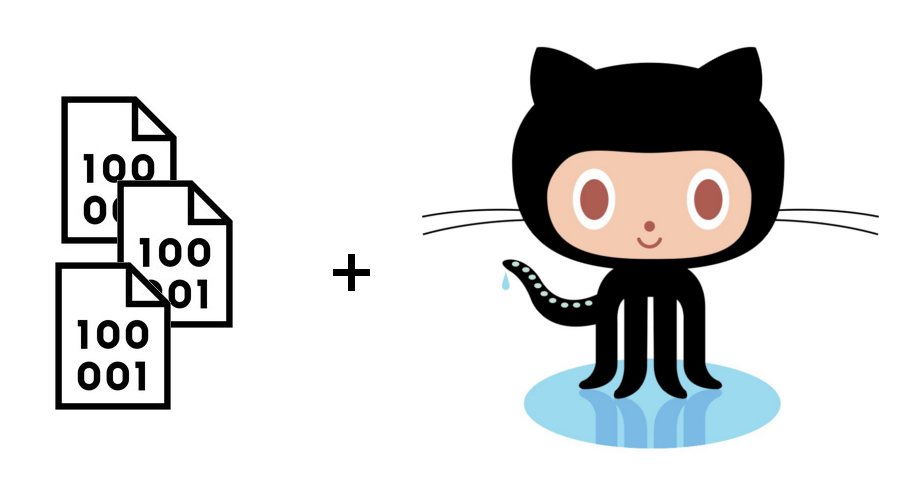

<h1>Git y GitHub</h1>
<h3>Freddy Vega</h3>
<p align="center"><a href=""></a></p>

<h1> Tabla de Contenido</h1>

- [Objetivo](#objetivo)
  - [Iniciar Git](#iniciar-git)
- [Open SSL](#open-ssl)
  - [Acerca de SSH](#acerca-de-ssh)
    - [Tipos de archivos](#tipos-de-archivos)
  - [Tabla de Comandos Básicos](#tabla-de-comandos-básicos)
  - [Stagin y los repositorios](#stagin-y-los-repositorios)
  - [Git rm](#git-rm)
    - [Git es una base de datos precisa](#git-es-una-base-de-datos-precisa)
    - [Las ramas amplifican mucho más el potencial de git](#las-ramas-amplifican-mucho-más-el-potencial-de-git)
  - [configurar git](#configurar-git)
  - [Analizar los cambios de los archivos](#analizar-los-cambios-de-los-archivos)
  - [Ramas o brances en git](#ramas-o-brances-en-git)
  - [Fusión de ramas con Git Merge](#fusión-de-ramas-con-git-merge)
- [Resolución de Conflictos la hacer un merge](#resolución-de-conflictos-la-hacer-un-merge)
  - [Corregir manualmente](#corregir-manualmente)
  - [Uso de GitHub](#uso-de-github)
  - [Configurar llaves SSH en local](#configurar-llaves-ssh-en-local)
    - [Configurar key gitlab](#configurar-key-gitlab)
  - [Tags-Etiquetas](#tags-etiquetas)
  - [Enviar ramas al servidor](#enviar-ramas-al-servidor)
    - [¿Cómo eliminar un repositorio de Git creado con ‘git init’ en un directorio?](#cómo-eliminar-un-repositorio-de-git-creado-con-git-init-en-un-directorio)
    - [Borrar archivos | carpetas del repositorio](#borrar-archivos--carpetas-del-repositorio)
    - [¿Cómo renombrar una rama local de Git?](#cómo-renombrar-una-rama-local-de-git)
    - [¿Cómo cambiar el nombre de una rama remota de Git?](#cómo-cambiar-el-nombre-de-una-rama-remota-de-git)
  - [Configurar multiples colaboradores en GitHub](#configurar-multiples-colaboradores-en-github)
  - [Fork desde Consola](#fork-desde-consola)
  - [Deployment a un Servidor](#deployment-a-un-servidor)
  - [Subir imagenes a nustro proyecto](#subir-imagenes-a-nustro-proyecto)
- [README](#readme)
- [Git Stash](#git-stash)
  - [Git Clean](#git-clean)
  - [Git Cherry-Pick](#git-cherry-pick)
  - [Git Amenud](#git-amenud)
  - [Git Reset y Reflog](#git-reset-y-reflog)
  - [Commits de Git Grep y Log](#commits-de-git-grep-y-log)
  - [Recuroso Colaborativos en Git y GitHub](#recuroso-colaborativos-en-git-y-github)


  Curso de [Git y Github](https://platzi.com/cursos/git-github/ "Git y Github") de [Platzi](https://platzi.com "Platzi")


# Objetivo

  Como desarrollador siempre debemos de contar con una herramienta/software para nuestros control de versiones de los proyectos. Git y GitHub es la red social de los desarrolladores. Git es el sistema de control de versiones. 

  Git fue creado por Linus Torval.

  Los beneficios de utilizar **Git Y GitHub** desde la terminal es:
    
  * Manejo de los cambios.
  * Recuperar archivos
  * Guardar Cambios 
  * ¿Quién hizo los cambios? y muchas cosas más.

## Iniciar Git
**Comandos Básicos**

Inicar git en tu proyecto desde tu repositorio local.
```bash
  git init  

  git add <nombre-del-archivo> 

  git comit -m "Comentario, especificar la acion realizada y es necesario en cada commit" 

  git status
  
  git show

  git log

  git pull

  git push
```
Al realizar un commit los archivos son enviados a 
* **`git add`** Agrega todos los archivos.
* **Staging area :** almacenamiento temporal.Staging -> área en memoria ram que almacena la información que va a enviarse al repositorio. Git commit-> envía la información al repositorio y genera versiones de nuestros archivos. Checkout -> permite regresar un archivo a una versión anterior previamente guardada en el repositorio.

* **`git commit -m "mensaje"`** Agrega a la base de datos, en la base de archivos.
*  **`git status`** Ver el estado de archivos y cambios.
* **`git show`** Ver los cambios historicos realizados.
* **`git log`** Historia entera de un archivo.
* **`git pull`** Trea el repositorio
* **`git push`** Envia al repositorio remoto

# Open SSL

[Conectar a GitHub con SSH](https://docs.github.com/es/free-pro-team@latest/github/authenticating-to-github/connecting-to-github-with-ssh)

## Acerca de SSH

Usando el protocolo SSH, te puedes conectar y autenticar con servicios y servidores remotos. Con las claves SSH, te puedes conectar con GitHub sin suministrar tu nombre de usuario ni contraseña en cada visita.

[Generar una nueva clave SSH y agregarla al ssh-agent](https://docs.github.com/es/free-pro-team@latest/github/authenticating-to-github/generating-a-new-ssh-key-and-adding-it-to-the-ssh-agent)

### Tipos de archivos

* **Archivos de texto:** Texto plano normal y sin nada especial.
* **Archivos RTF:** Podemos guardar texto con diferentes tamaños, estilos y colores. Si lo abrimos en un editor de código, es más complejo que solo el texto plano. Archivo binario.
* **Archivos DOCS/word:** Podemos guardar imagens texto con diferents tamaños y estilos, colores. Un editor de código, le es complicado entender los datos de un archivo binario.

**[Git](https://destevez.me/diffs-con-git.html)** fue diseñado para almacenar código fuente, que normalmente se guarda en archivos de texto. Si tenemos alguna forma de obtener un archivo de texto a partir del binario que queremos guardar, **git** nos permite usar ese archivo en lugar del binario dentro del repositorio.



**Archivo de texto plano:** Un Texto plano (plain text), son aquellos archivos formados exclusivamente por texto (sólo caracteres), sin ningún formato; es decir, no requieren ser interpretados para leerse (aunque pueden ser procesados en algunos casos). También son llamados archivos de texto llano, simple o sin formato

**Archivo Binario:** Los archivos binarios que contienen bytes suelen ser interpretados como alguna cosa que no sean caracteres de texto. Un ejemplo típico son los programas de ordenador compilados; de hecho, las aplicaciones o programas compilados son conocidos como binarios, especialmente entre los programadores.

## Tabla de Comandos Básicos

| **Comandos Básicos** | **Descripción** |
|:--------: | :--------- |
| **pwd**| Ruta de carpetas |
| **cd**| Navegar por carpetas |
| **ls**| Mostrar los arhvios |
| **mdkir**| Crear carpetas |
| **touch**| Crear archivos |
| **cat**| Ver contenido de un archivo |
| **history**| Ver los últimos comandos ejecutados |
| **rm**| Borra un archivo o carpeta |
| **! + número**| Ejecutar algún comando con el número que nos muestra el comando history |
| **clear**| Limpia la terminal|

## Stagin y los repositorios

**`Archivo Tracked:`** Son los archivos que vivien dentr  o de git, no tienen cambios y sus útlimas actualizaciones han sido guardadas en el repositorio a través de ``` git add ``` y ```git commit -m "<mensaje>" ```

**`Archivos staged:`** Son archivos staging, viven dentro de git y hay registro de ellos porque han sido afectados por el comando ```git add```, aún que sus últimos cambios no. __Git__ sabe de la existencia de estos últimos cambios, pero todavía no ha sido guardados definitivamente en el repositorio. Aún falta ejecutar el comando `git commit -m "<mensaje>"`.

**`Archivo Unstaged:`** Archivos "Tracked pero Unstaged". Son archivos que viven dentro de git pero no ha sido afectados por el comando ```git add``` ni ```git commit``` tiene registro de estos archivos pero esta desactualizado, sus últimas versiones están guardadas enel _**Dico Duro**_.

**`Archivo Untracked:`** Son archivos que no vivien en git, solo en el disco duro. Nunca ha sido afectadso por ```git add```. Git no tiene registro de sus existencia.

Casos muy raro donde los archivos tiene dos estados al mismo tiempo: **Staged y Untracked**. Esto pas cuando guardas los cambios de un archivoenel área de **Staging** con el comando ```git add``` pero antes de hacer un commit para guardas los cambios en el repositorio, haces nuevos cambios que todavía no han sido guardados en el área de **Staging** (en realidad, todo sigue funcionado igual pero es un poco divertido).

**`git reset HEAD:`** Nos ayuda a sacar archivos del estado (staging) staged para devolverlos a su estado anterior. Si los envian de Unstaged, vuelven allí y los msmo se venía de Untracked.

**`git commit:`** Mover un archivo de unstaged a Tracked.

## Git rm

`git rm --cached` Mueve los archivos que le indiquemos al estado Untracked.

`git rm --force` Elimina los archivos de git y del disco duro. **Git** guarda la existencia de los archivos, por lo que podemos recuperar si es necesario (podemos utilizar comandos más avanzados).

`git checkout` Volver a traer cambios.

### Git es una base de datos precisa

_**Git**_ es una base de datos muy precisa con todos los cambios y crecimiento que ha tenido nuestro proyecto. Los commits son la unica forma de tener un registro de los cambios.

### Las ramas amplifican mucho más el potencial de git


Todos los commits se aplican sobre una rama. En la rama master (se puede cambiar el nombre, en el repositorio local. Con el siguiente comando `git branch -m <nuevo-nombre>`) creamos nuevas ramas, a partir de esta. Y crear un flujo de trabajo independiente.

Una rama es copiar un commit __(de cualquier rama)__, pasarlo a otro lado __(otra rama)__ y continuar el trabajo de una parte especifica de el proyecto, sin afectar el flujo de trabajo principal __(de la rama master o rama principal)__.

Los equipos de desarrollo tiene un estandar; todo lo que esta en el rama **_master_** va a producción, los nuevos cambios, características y experimentos van en una rama **_development_** (para unirse a master cuando este definitivamente listo) y los **issues** o **errores** se solucionan en 
una rama **hotfix** para unirse a master cuando sea posible.

## configurar git 

 [Configuración global de git](https://git-scm.com/book/es/v2/Inicio---Sobre-el-Control-de-Versiones-Configurando-Git-por-primera-vez)

 Ahora que tienes Git en tu sistema, vas a querer hacer algunas cosas para personalizar tu entorno de Git. Es necesario hacer estas cosas solamente una vez en tu computadora, y se mantendrán entre actualizaciones. También puedes cambiarlas en cualquier momento volviendo a ejecutar los comandos correspondientes.

 ```bash
git config --global user.name "John Doe"

git config --global user.email johndoe@example.com

git config --global core.editor emacs

git config --list

git config user.name
 ```
* Ver configuración por defecto `git config --list`
* Configuraciones guardadas `git config --list --show-origin`

## Analizar los cambios de los archivos

Analiar los cambios en los archivos del proyecto con **`git`**.

**`git show`:** cambios que han existido sobre un archivo, util para detectar ¿Cuándo se produjeron ciertos cambios? ¿Qué se rompió y Cómo podemos soluciarlo? Pero podmeos ser más detallados.

**`git diff commit A commit B:`** Ver la diferenica entre una versión y otra. No necesariamente todos losa cambios desde la creación del archivo.

**`git log:`** Obtener ID de los commits.

**`git checkout + ID-del-commit`:** Nos permite viarjar en el tiempo. Podemos volver a cualquier versión anterior de un archivo específico o incluso del proyecto entero. también es la **forma de crear ramas y movernos entre ellos.

**`git reset:`** Vovemos en el tiempo y borramos los cambios que hicimos después de un commit.

**`git reset --hard:`** borra toda la información que tengamos en el área de staging (Perder todo para siempre).

**`git reset --soft`:** Mantiene los archivos en el área de *staging* para que podamos aplicaar nuestros últimos cambios pero desde un commit anterior.

al ejecuatar `git reset ID --hard` volvemos al anterior commit.

**`git log --stat:`** Ver cambios específicos al realizar el commit.

**`git rm`:** Elimina archivos de **git** sin eliminar su hitoria del sistema de versiones. Y es posible recuperarlo, recuperar el último commit antes de borrar el archivo.

**`git rm --cached:`** Elimina los archivos del área de **staging** y del próximo commit pero los mantiene en el disco duro.

**`git rm --force`:** Elimina los archivos de git y del disco duro, git siempre guarda todo. Podemos acceder al registro de la existencia de archivos y recuperar (pero debemos utilizar comandos avanzados).

**`git reset:`** Volvemos al pasado sin poder retornar al futuro. Borra el historial y la debemos sobreescribir.

**`git reset HEAD`:** Comando para sacar archivos del área de staging. Se utiliza para los últimos cambios de estos archivos, no enviados al último commit.

**`git clone <url>`:** Nos permite descargar los archivos de la última versión de la rama principla y todo el historial de cambios en la carpeta .git.

**`git push:`** Mandar los cambios a un servidor remoto.

**`git fetch`** Traer actualizaciones del servidor remoto y guardarlas en el servidor local.

**`gt merge`:** Se utiliza con servidores remotos. Combinar los últimos cambios del sevidor remoto y nuestro directorio del trabajo.

**`git pull`:** git fetch y git merge al mismo tiempo.

## Ramas o brances en git 

Las ramas son la forma de hacer cambios a nuestro proyecto sin afectar el flujo de trabajo de la rama principal. Esto porque queremos trabajar un parte muy específica de la aplicación o simplemente experimentar.

**`Cabecera o HEAD`:**  Representan la rama y el commit de esa rama donde estamos trabajando. Por defecto está cabecera aparecera en el último commit de nuestra rama principla. Pero podemos cambiarlo al cera una rama: 
```bash
git branch rama(<nombre-de-la-rama>)

git checkout -b rama(<<nombre-de-la-rama>)
```
o nos movemos en el tiempo a cualuqier otro commit de cualquier otra rama con los commits.
```bash
git reset id-commit

git checkout rama o id-commit
```
**HEAD:** Indicador de la versión de los commit, estamos viendo.

## Fusión de ramas con Git Merge

`git merge` nos permite crear un nuevo commit con la combinación. (Rama donde nos encontramos cuando ejecutamos el comando y la rama que indiquemos después del comando)

Estando en la rama master, ejecutamos merge.

```bash
git checkout master

git merge cabecera
```

o de una rama a otra rama
```bash
git checkout cabecera

git merge <nombre-de-rama>
```
**Git** sabe que cambios queremos conservar de una rama y qué otros de la otra. En algunos casos de las ramas tiene actualizaciones en diferentes o en ciertas líneas del archivo. Esto se le conoce como conflicto.

# Resolución de Conflictos la hacer un merge

## Corregir manualmente

Editas el archivo acceptando los cambios.
## Uso de GitHub


**Conectar nuestro repositorio remoto**
```bash

git remote add origin <pegamos-el-link>

git remote -V

git push origin master
```
Ingresamos credenciales

* **`fetch`:** traer cosas.
* **`push:`** enviar cosas.

Ver datos del usuario: `git config -l`.


## Configurar llaves SSH en local

[Crear llaves SSH](https://platzi.com/tutoriales/1557-git-github/4067-configurar-llaves-ssh-en-git-y-github/)

```bash
ssh-keygen -t rsa -b 4096 -C "email"

eval $(ssh-agent -s)

ssh-add  <ruta-de-la-llave> ruta ~/.ssh/id_rsa

ssh-add ~/.ssh/id_rsa     	# Linux y windows
ssh-add -k ~/.ssh/id_rsa  	# solo en mac se le agrega -k
```

### Configurar key gitlab

```bash
ssh-keygen -t rsa -b 4096 -C "email"

eval $(ssh-agent -s)

ssh-add  <ruta-de-la-llave> ruta ~/.ssh/id_rsa

ssh-add ~/.ssh/id_rsa     # Linux y windows
ssh-add -k ~/.ssh/id_rsa 	# solo en mac se le agrega -k
```

-  Conectar git  a gitlab
-  Crear en el directori `/home/usr/.ssh` el archivo `config`

```bash
# Crear archivo
touch config

# Conceder permisos
chmod +x config

# editamos con vim, vi, nano ...
vim config
```

**Archivo** `config`

```bash
# Configuracion GitLab
Host *
  AddKeysToAgent yes
  IdentityFile ~/.ssh/key       # Llave privada -> key con diferentes nombres

# Configuracion GitLHu
Host *
  AddKeysToAgent yes
  IdentityFile ~/.ssh/key       # Llave privada -> key con diferentes nombres
```

Haz, establecido conexion correctamente con Gitlab & Github. Felicidades

**conectar github con ssh**
```bash

git remote -v

git remote set-url origin <pegamos-link-ssh>
```
**Traer la último actualización del repositorio**

```bash
git pull

git pull origin master

git push origin master
```
## Tags-Etiquetas

**Tags-Etiquetas:** Asignan una versión a los commit o significado de muestro proyecto.

**Crear un tag a un commit** 

```bash
git tag -a name id-commit
```

**Borrar tag en repositorio local** 

```bash
git tag -d <nombre-del-tag>`

# Listar los tags del repositorio local


git show-ref --tags
```

**Publicar un tag en el repositorio remoto** 
```bash
git push origin --tags
```

**Borrar un tag del repositorio remoto** 

```bash
git tag -d <nombre-del-tag>
```
o 

```bash
git push origin :refs/tags/<name-tag>
```

**Crear alias** 

```bash
alias arbolito = "git log --graph --decorate --oneline"
```
ejecutamos 

```bash
git arbolito
```

## Enviar ramas al servidor

```bash
# crear rama

git branch <nombre-de-la-rama>

git checkout -b <nombre-de-la-rama>

# Enviar rama al servidor

git push origin <nombre-de-la-rama> 			# footer-header
```
### ¿Cómo eliminar un repositorio de Git creado con ‘git init’ en un directorio?

Git guarda todos los cambios realizados en el directorio .git de la carpeta donde se el repositorio. Para eliminarlo simplemente hay que borrar esa carpeta.

cd carpeta/

```bash
rm -rf .git
```

  ### Borrar archivos | carpetas del repositorio

  Para borrar archivos o carpetas en nuestro respositorio (bitbucket, github...) se usa el comando `rm` de **git** con los siguientes pasos:

  **1. Eliminar un archivo**

  ```bash
  git rm miarchivo.php # Estar en el directorio
  ```

  **1.1 Eliminar una carpeta | directorio**

  ```bash
  $ git rm -r mi-carpeta
  ```

  **2. Creamos el commit**

  ```bash
  $ git commit -m "elimino archivos innecesarios"
  ```
  **3. Subimos los cambios al repositorio**

  ```bash
  $ git push <origin master> # Rama Master
  ```

  ### ¿Cómo renombrar una rama local de Git?

- Al empezar, asegúrate de estar en la rama a la que quieres cambiarle el nombre, luego sigue los pasos según corresponda:

```bash
git checkout old-name
```

- Si deseas ver todas tus ramas locales, usa el siguiente comando:

````bash
git branch --list
````

- Cuando esté todo claro, sigue estos pasos:

- El uso del comando Git rename branch requerirá que agregues una opción `-m`:

```shell
git branch -m new-name
```

- También puedes cambiar el nombre de una rama local desde otra rama usando los siguientes dos comandos:

```bash
git checkout master

git branch -m old-name new-name
```
- Para finalizar, este comando listará todas las ramas, tanto locales como remotas, para verificar que se les haya cambiado el nombre:

```shell
git branch -a
```

  ### ¿Cómo cambiar el nombre de una rama remota de Git?

1. Aunque no es posible cambiar directamente el nombre de una rama remota. El proceso de renombrar una rama remota de Git implica seguir estos tres pasos:

2. Para empezar, necesitarás renombrar la rama local siguiendo los pasos explicados antes.
Luego borra la rama anterior y aplica push a la nueva. Puedes hacerlo fácilmente con los siguientes comandos:

```bash
git push origin --delete nombre-anterior

git push origin :nombre-anterior nombre-nuevo
```

3. Restablece la rama ascendente para tu nueva rama local y estará listo:

```bash
git push origin -u nombre-nuevo
```

## Configurar multiples colaboradores en GitHub

* Agregar a colaboradores desde GitHub.

**`Pull request`** Verificar el códogo el equipo, y realiza los cambios.

## Fork desde Consola

**git pull fork desde cosola**

```bash
git remote add upstream <pegamos-el-link>

git remote -v

git pull upstream master  # Traemos la rama principal

# subir los cambios 

git add .

git commit -m "<mensaje>"

git push origin master
```
## Deployment a un Servidor

**[servidor](https://www.jaimeolmo.com/2015/02/como-usar-git-para-hacer-deploy-de-nuestro-website/)**

```bash

cd /var/www/<servidor>/<archivo.html>/ # Carpteta del servidor

git clone <link>

git status

git pull origin master
```
## Subir imagenes a nustro proyecto

* A github no enviar los archivos binarios.

* Utilizar fuentes externas, para los archivos binarios para las imagenes podemos utilizar los servicios de los sitguientes sitios.

  * [Imagur](https://imgur.com)
  * [Imgbb](https://es.imgbb.com)
  * [ImageShack](https://imageshack.com)

# README

  **Markdown Editor**

  * [MEditor](https://pandao.github.io/editor.md/en.html)
  * [Typora](https://typora.io/) 😍😍😍

  **[Markdown](https://es.wikipedia.org/wiki/Markdown)** es un lenguaje de marcado ligero creado por John Gruber que trata de conseguir la máxima legibilidad y facilidad de publicación tanto en su forma de entrada como de salida, inspirándose en muchas convenciones existentes para marcar mensajes de correo electrónico usando texto plano.

> **[Markdown](https://www.genbeta.com/guia-de-inicio/que-es-markdown-para-que-sirve-y-como-usarlo)** es un lenguaje de marcado que facilita la aplicación de formato a un texto empleando una serie de caracteres de una forma especial. En principio, fue pensado para elaborar textos cuyo destino iba a ser la web con más rapidez y sencillez que si estuviésemos empleando directamente HTML.

  Un archivo **[.md](https://www.ionos.mx/digitalguide/paginas-web/desarrollo-web/que-es-un-archivo-md/)** es un documento de texto simple que no contiene ningún otro elemento. En él, pueden introducirse símbolos en el texto para definir el formato de ciertas secciones. ... Los lenguajes de marcado pueden escribir y editarse en cualquier editor de texto.

# Git Stash
**Guardar cambios en la memoria y recuperar después**

```bash
git stash           # | guardar en memoria.

git stash list      # | En llistar los stash

git stash pop       #  | Traer stash en primer plano
```
**Agregar a una rama**
```bash
git stash branch <nombre-de-la-ramar>
```
**Stash que no debe guardarse**
```bash
git stash

git stash drop
```

## Git Clean 

Limpiar el proyecto de archivos no deseados.

Archivos como:
  * log
  * Resultados
  * Compilación 
  * imagenes

  ```bash
  git clean --dry-run     # ver lo que hay que borrar

  git clean -f
  ```
  ## Git Cherry-Pick

  Traer commits viejos al head de un branch 

```shell
git cherry-pick id-commit
```


  ## Git Amenud
  > Una operativa corriente del mantenimiento de un repositorio Git consiste en modificar el commit realizado por último con la opción --amend. ... Básicamente se trata de modificar el último commit, en lugar de crear uno nuevo. -  [desarrolloweb.com](https://desarrolloweb.com/articulos/modificar-ultimo-commit-git.html#:~:text=Una%20operativa%20corriente%20del%20mantenimiento,con%20la%20opci%C3%B3n%20--amend.&text=B%C3%A1sicamente%20se%20trata%20de%20modificar,lugar%20de%20crear%20uno%20nuevo.)

  Con el siguiente comando:

  ```bash
  git commit --Amenud
  ```

  ## Git Reset y Reflog

  **Usarse en caso de emergencia.**

  ```bash
  git reset --soft

  git reset --hard
  ```
```bash
  git reset Hash-del-HEAD
```
  ```bash
  # ver información
  git reglog
  ```

  ## Commits de Git Grep y Log

Buscar archivos y commits de git con grep y log

```bash

git grep -n color       # palabras

git grep -C color       # Archivos y números

git log -S <nombre-de-la-rama> # commits
```

## Recuroso Colaborativos en Git y GitHub

<p align="center">
<a href=""></a>
<a href=""></a>
</p>

**Comandos**

```bash
git branch -a 

git shortlong -sn 

git shortlong -sn --all

git shortlong --on --all --no-meges

git blame <archivo> -c 

git blame <ruta>/<archivo> -L20,35 -c

git branch -r 

git branch -a 
```
<h1>End</h1>

