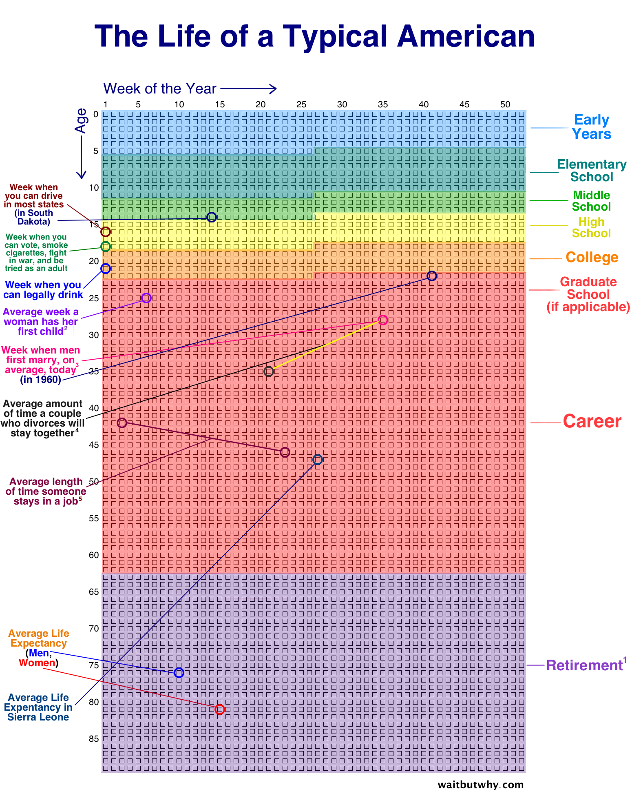

# Desarrollo Profesional

#### Marian villa

# 1. Deconstruye tu vida

## Conocer nuestra personalidad

**Conocete**

Realiza uno de estos test, e identifica como eres. Y dale vidad a tu personalidad, no te limites...

- [Eneagram](http://www.testeneagrama.com/web/index.html)
- [high5test](https://high5test.com/)
- [Truity](https://www.truity.com/)
- [the Big Five Personality Test](https://www.truity.com/test/big-five-personality-test)
- [DISC](https://www.123test.com/disc-personality-test/)
- [16Personalities](https://www.16personalities.com)

  ## Auditoría de la vida

  **La teorìa**

  Es una auditoría reflexiva de su padaso reducida a un gráfico con 52 cuadros por fila, cada cuadro representa una semana y cada fila un año.

  > “La vida debe vivirse al pensarse”. Es hora de saber en qué te has gastado el tiempo de tu vida realizando una auditoría de tu pasado.

  - En enlace de “Life in Weeks” lo encuentras en la sección de “Archivos y Enlaces”.

  **Llenar las casillas de _Life in Weeks_ la siguiente manera**

  * [Life in weeks](https://onedrive.live.com/view.aspx?resid=B9A5E09DC677935A!28469&ithint=file,xlsx&authkey=!ABKoxbvvxgmnQIQ)

  

	[AIT BUT WHY](https://waitbutwhy.com)

  Recuerda después de realizar el diagnóstico:

  - Entender las macro categorías de tu vida
  - Identificar el % en donde está más recargada tu vida
  - Revisa las épicas
  - Momentos de enfermedad o muerte
  - Saca tu propia #DataSelfie

  ## Conocer la persona productiva

	> “La vida es todo eso que pasa mientras haces planes; haz los planes y ejecútalos”

**Tips:**

* Replantea tus objetivos.
* Aprende a decir sí y no.
* Usa planificaciones flexibles.
* Estar vivo y despierto a la realidad que estás construyendo.
* Haz las tareas.
* Aprende a perdonarte.
* Basate en el equilibrio y descansa.

**Agilismo aplicado al Personal UX:**

> “La vida es todo eso que pasa mientras haces planes; haz los planes y ejecútalos”

**Autoconocimiento**

* Perspectiva
* Planear
* Revisar
* Focalizar
* Tomar decisiones
* Medición
* Documentar
* Reflexionar
* Poner en acción
* Iteración

**Principios de Leonardo DaVinci:**

Curiosidad: “Nunca pares de aprender”

Conexión: el reconocimiento de la interconexión de todas las cosas y de todos los fenómenos. “Pensar en términos de sistemas”.

  ## Autoconocimiento

Autoconocimiento: es la gestión de ti mismo

Implica gobernar áreas específicas de ti: __tiempo, recursos, canales__ (plataformas soicales), __hábitos__ (alimentación y hasta esas cosas que te hacen daño)

**Debes saber gobernar las áreas de tu vida:**

Tiempo
Recursos
Canales
Hábitos

**Ejercicios de las 6W’s**
> "La calidad de tu vida se basa en las preguntas que te haces"

**Ejercicio de las 100 Preguntas**
Elementos:

* WHEN?
* WHERE?
* WHAT?
* WHO?
* HOW?
* WHY?

**Hoja | Lápiz o pluma**

Vas a comenzar a escribir cualquier pregunta que se te venga a la mente, no importa si es “tonta o ridícula”, escríbelas. El objetivo es llegar a las 100 preguntas.

**Nota:** a partir de las 50 te vas a empezar a quemar pero debes llegar a las 100 para que puedas continuar. Entre más avances mejores serán tus preguntas.

**Responde las 6W’s:**

* ¿Qué?
* ¿Cómo?
* ¿Dónde?
* ¿Cuándo?
* ¿Por qué?
* ¿Para qué?

**Resuelve el FODA**

Para finalizar debes resolver el FODA basándote en las 6 preguntas y utilizando los test que resolviste en las clases anteriores.
Puedes usar la herramienta MIRO, pero yo recomiendo el papel.

**Fortalezas:**

* ¿Qué tienes que otros no?
* ¿Qué haces mejor que otros?
* ¿Cómo describen los demás tus puntos fuertes?
* ¿Qué valores son únicos para ti?

**Debilidades:**

* ¿Cuáles son las tareas que evitas?
* ¿En qué crees que no eres bueno?
* ¿Cómo son los rasgos de personalidad que te detienen?
* ¿Cuáles crees que son tus hábitos negativos o malos?

**Oportunidades:**

* ¿Te consideras parte de la industria en crecimiento?
Si es así, ¿Cómo puede utilizar sus recursos para aprovechar este crecimiento?
* ¿Tú no estás haciendo algo?
¿Hay algo de lo que se quejen sus clientes o empleadores?

**Amenazas:**

* ¿Cuáles son los obstáculos en tu vida profesional?
* ¿Eres parte de un entorno competitivo poco saludable?
* ¿Cambiar la tecnología es una amenaza para tu posición actual?
* ¿Te sientes amenazado por alguna de las debilidades de tu propio “user persona”?

* [miro](https://miro.com)

  ## Personalidad y productividad

¿Has intentado empezar una tarea, pero no has encontrado la motivación adecuada para acabarla? ¿Has indagado por qué no lograste terminarla? Si no es así, no te preocupes esto está relacionado con rasgos de tu personalidad y cuál es el rol de liderazgo que asumes al abordar las tareas.

El entrenador de liderazgo estadounidense y **autor Marshall Goldsmith** toma teorías clásicas de las empresas y argumenta que las personas tienen que enfrentar los mismos obstáculos:

* Distracciones del entorno que alejan del objetivo.
* Falta de motivación.
* Falta de autodisciplina.

Cuando se trata de problemas de motivación se trata de identificar qué tipo de tareas logras completar y cuáles dejas atrás. Estas etapas suelen encajarse en tres tipos, los pensadores, los que planifican y los hacedores.

**Los pensadores:** son los que disfrutan la etapa del brainstorming, examinar cada una de las posibilidades. Son creativos con gran imaginación. Son positivos y prefieren explorar suficiente antes de emitir un juicio.

**Los planeadores:** son estratégicos, les gusta encontrar la mejor manera de ejecutar una idea. Son creativos, pero lo acompañan con un gran instinto de pensamiento lógico. Los planeadores son racionales que logran sintetizar el problema y tener el mapa de ruta claro. Aquí se encuentran la mayoría de líderes, son los inspiradores, ambiciosos y fuertes. Son organizados con una lista clara de las tareas para hacer.

**Los hacedores:** están “orientados a la acción”, y esto no significa correr a toda máquina en cada objetivo brillante, significa encontrar la acción más efectiva para acercarlo a sus objetivos.

**Qué puede aprender un planeador de un hacedor:**

* Los hacedores son los maestros de la acción, les gustan los resultados y toman responsabilidad de ellos.
* Son los que hacen que las cosas pasen. Ellos no piensan mucho, ejecutan.
* Puede olvidarse mucho de los plazos, especialmente si no se le consultó detenidamente al configurarlos en primer lugar.
* Puede tener dificultades para adivinar cuánto tiempo llevará una tarea.
* La falta de proceso puede hacer que sea difícil replicar pequeños milagros y delegar tareas.
* El perfeccionismo puede paralizar.
* Solo comenzar ahorra mucho tiempo.
* Lo que pueden aprender los hacedores de los planeadores:

**Necesitas un plan.**

La estructura puede ser útil.
La tendencia a la acción aún postula la necesidad de planificar.

Un equipo se beneficia cuando los hacedores y los planificadores comparten ideas. Funcionar en equipo significa utilizar las fortalezas de todos. También puede significar tomar prestados los superpoderes de otras personas para fortalecer su propio flujo de trabajo o sus hábitos de productividad. Si eres una persona más orientada a la acción que puede tender a ser reacio al plan, podría ser útil pensar en lo que podrías aprender de un compañero de equipo o mentor que viene a ti con un diagrama de Gantt o una lista de tareas.

**Sobre la motivación**

La motivación es muy poco sobre hacer y mucho sobre sentir. Una de las técnicas de motivación más confiables que puedes usar es la emoción. En lugar de preguntarte **“¿qué necesito hacer?”** intenta preguntar *“¿cómo me quiero sentir al final del día / semana / año?”*

**¿Por qué procrastinamos?**

Porque proviene de una reacción emocional a lo que estás evitando. Los científicos lo llaman “reparación del estado de ánimo” así que nuestros esfuerzos están en ser felices en el presente, y pensar en el futuro implica una carga adicional.

Evitamos los sentimientos incómodos asociados con nuestro trabajo al pasar tiempo en actividades que mejoran el estado de ánimo, como jugar juegos.

Entonces, la próxima vez que te encuentres postergando, tómate un tiempo y valor para sentirte ansioso en lugar de tratar de ocultarlo. *¿Sobre qué es realmente? ¿Es el miedo a hacer, o simplemente la ansiedad de no hacer? Finalmente, ¿Y qué vas a hacer al respecto?*

El truco para ‘hackear’ nuestro estado procrastinador tiene dos vías:
Hacer que el trabajo se sienta menos incómodo.
Convencernos para enfocarnos en el futuro, a largo plazo.
Para lograrlo intenta:
Generar progreso así sea pequeño, esto puede ser un gran motivador para continuar.

Un paso a la vez en el ahora.

Pide ayuda, y habla abiertamente de tu estrés, de lo que sientes. Recuerda que son emociones.

* Imagina el futuro, está demostrado que la visualización hace que se tomen mejores decisiones ahora.

* Enfocarte en una tarea a la vez.

* Configura un cronómetro. Te recomiendo que para este paso revises la técnica pomodoro.

* Por favor perdónate, esto implica reemplazar con sentimientos positivos los de culpabilidad.

* Por último te comparto este truco del libro de Mark Forster, Do It Tomorrow. En el que sugiere engañar tu mente diciéndote lo siguiente:

* Realmente no voy a la tarea en este momento, pero simplemente haré su primer paso

  ## Conocer la rueda de la vida

Les quiero aportar una herramienta que uso frecuentemente para conocer mis fortalezas y debilidades de las áreas de mi vida.

* [Remente](https://www.remente.com/)

* [Flipping the Script On 2020 Starts Here](https://assessments.michaelhyatt.com/lifescore/)

  ## Reconocer tu Hero Canvas

	**Identifiquemos los roles claves en tu vida:**

* Inspiradores
* Mentores
* Coaches
* Role Models
* Sponsors
* Advisors

**Análisis por cada categoría:**

* Pensamiento
* Relaciones
* Liderazgo
* Emoción
* Autodirección
* Actitud
* Resultados

**Análisis por cada Héroe:**

* Objetivos
* Relaciones
* Rasgos
* Obstáculos
* Emociones
* Preguntas
* Comportamientos

  ## El mapa de empatía como plataforma de

Un mapa de empatía permite aumentar el entendimiento que tenemos de nosotros o también lo utilizan a nivel de negocio para entender un grupo objetivo o personas determinadas.

Se trata de analizar las características y comportamientos de las personas, en este caso tu propia persona. Para iniciar con esta herramienta es importante que se recolecte la información previa, que ya debes tener por los ejercicios anteriores abordado en nuestro curso de productividad, y si aún no lo tienes, puedes recolectarla mediante entrevistas, *(la más apropiada para este ejercicio)* y si lo haces para validar un público en términos empresariales puedes aplicarlo por observación u otras técnicas de UX.

La matriz permite tabular la información recolectada, y al finalizar tendrás un mejor entendimiento de tu propia persona o de un público objetivo determinado.

Las variables que trataremos de validar en nuestro ejercicio y que están expuestas en la matriz son variables asociadas metafóricamente a un sentido, estas variables son:

**En un primer nivel:**

* ¿Qué oye?

* ¿Qué ve?

* ¿Qué dice y hace?

* ¿Qué piensa y siente?

**En un segundo nivel:**

Esfuerzos

Resultados

La matriz consta de 6 módulos, en el área central encontramos la personificación del usuario, en este caso nosotros, *‘Nuestro propio usuario’*, la matriz en primera instancia generalmente se trabaja de manera análoga, y luego podría digitalizarse o trabajarse en una herramienta como: *Google Draw, Muraly o Miro*.

Para toda la matriz se trata de tomar palabras claves, en técnicas de las ciencias sociales esto se llama ‘Verbatim’ hay que estar despierto a estas claves en la entrevista. Recuerden que no se trata de tener las respuestas, se trata de las preguntas adecuadas. Una buena práctica es grabarlas con la autorización del entrevistado, incluso es importante que tengas un formato firmado de esta autorización.

¿A quién le puedes hacer la entrevista?
Se la puedes realizar a Familiares, amigos o mentores.

Antes de realizar las entrevistas, revisa claramente las preguntas, grabalas, y escúchalas posteriormente. Es importante que selecciones 5 personas y no realices más de este número, seguro que con 5 personas puedes identificar una tendencia. Si quieres saber más te dejo un link en recursos al finalizar este artículo, para que sepas aprovechar más esta técnica.

**Entonces, retomando:**

* Seleccionar mis 5 personas claves a entrevistar

* Ejecuta la entrevista, y grábala para posterior consulta

* Escúchalas, encuentra patrones, verbatims, y trata de consolidar todo en el formato

* Cuestionario para aplicar el Mapa de Empatía a nuestro ‘Propio Usuario’

**Introducción:**

No quiero que te rias, y quiero agradecerte que seas honesto y abierto con tus respuestas, me ayudará a entenderme, y validar si mi forma de actuar es coherente para ti y mis personas cercanas. En algunas preguntas te pediré que asumas mi lugar, y por tanto trates de contestar usando mi rol en la respuesta, como si fuera una obra de teatro y yo fuera el personaje.

Comencemos…

**WHO?**

* ¿Quién soy?

* ¿En una palabra cómo me defines?

* ¿Cuál es mi entorno?

* ¿Qué aspecto tengo?

* ¿Qué me rodea?

* ¿Quiénes son mis amigos?

De ellos, ¿quiénes son las personas clave?

* ¿Qué problemas enfrentó?

**WHAT do they need to DO?**

Aquí vamos a revisar las necesidades de mi propio usuario:

* ¿Qué necesito hacer de un modo diferente?

* ¿Qué trabajos quiero o necesito hacer?

* ¿Qué decisiones necesito tomar?

* ¿Cómo sabremos que tuve éxito?

**What do they SEE?**

Aquí nos centraremos en nuestros estímulos visuales:

* ¿Qué es lo que veo en el mercado?

* ¿Qué veo en mi entorno inmediato?

* ¿Cómo veo yo el mundo?

* ¿Qué estoy viendo o leyendo?

**What do they SAY?**

Aquí es lo que digo. Citas textuales o comentarios sobre si mismo.

* ¿Qué me has oído decir?

* ¿Qué puedes imaginar que digo?

* ¿Sobre qué suelo hablar?

***What do they DO?***

Aquí describimos mis acciones:

* ¿Qué hago hoy en día?

* ¿Qué comportamiento has observado mío?

* ¿Qué te imaginas que hago?

**What do they HEAR?**

Aquí revisaremos los estímulos sonoros: música, conversaciones, influencias y medios de comunicación. Preguntas para indagar en este aspecto podrían ser:

* ¿Qué estoy escuchando decir a los demás?

* ¿Qué estoy escuchando de mis amigos?

* ¿Qué estoy escuchando de mis compañeros de trabajo?

* ¿Qué estoy oyendo de manera indirecta?

**What do they THINK and FEEL?**

Aquí trataremos de capturar lo que pienso y siento. Debemos empatizar para que puedan verbalizar lo que ellos piensan que pensamos.

Es preferible separar los esfuerzos de las ganancias.

¿Qué pensamientos y sentimientos motivan mi comportamiento?

**Para frustraciones:** ¿cuáles son mis temores, frustraciones y angustias?

**Para ganancias:** ¿cuáles son mis deseos, necesidades, esperanzas y sueños?

  ## Definir tu User Persona

* Identificar tu propio User Persona.
* Definir atributos (elige palabras claves).
* Aplica el mapa de la empatía (lo encuentras en el * Toolkit del curso en “Archivos y Enlaces”).
* Conectar: pasiones / sueños / propósitos.

**Preguntas Claves:**

* ¿Qué haces? (Qué)
* ¿Cómo lo haces? (¿Cómo?)
* ¿A quién estás sirviendo?
* ¿Por qué lo haces? (¿Por qué?)
* ¿Qué es diferente? (Unicidad)

**Ikigai:**

Pasión = Afición + Habilidades

* ¿Qué amas hacer?

**Profesión** = Habilidades + Mercado/Demanda
¿En qué eres bueno?

**Vocación** = Mercado/Demanda + Valor
¿Qué puedo hacer sintiendo que aporto valor y cómo puedo al mismo tiempo cobrar por ello.

**Misión** = Afición + Valor
¿Cómo puedo unir lo que amo hacer y ayudar a otros a crecer, a mejorar con ello?

# 2. Documenta un punto de vista de tu vida

  ## Crea tu propósito y tu propuesta de valor

  **Mejores prácticas para redactar tu manifiesto:**

* Examinar la vida de otros.
* Determina tu yo ideal.
* Considera tu legado.
* Determina tu propósito.
* Clarificar tus aptitudes.
* Escribe tu declaración.
* Refínela.
	
## Proyecta tu plan de vida

## Proyecta tu plan de vida

# 3. Reconstruye tu vida

## Rediseña tu vida

## Aplica Design Thinking a tu vida

## Cómo fijar objetivos estratégicos

## Conoce las 3 P de la productividad

# 4. Claves para ser productivo

## GTD® (Getting Things Done®)

## Cómo dejar de perder el tiempo

## Espacio y ciclos

## Rituales y rutinas

## Hábitos

## El método Ivy Lee

